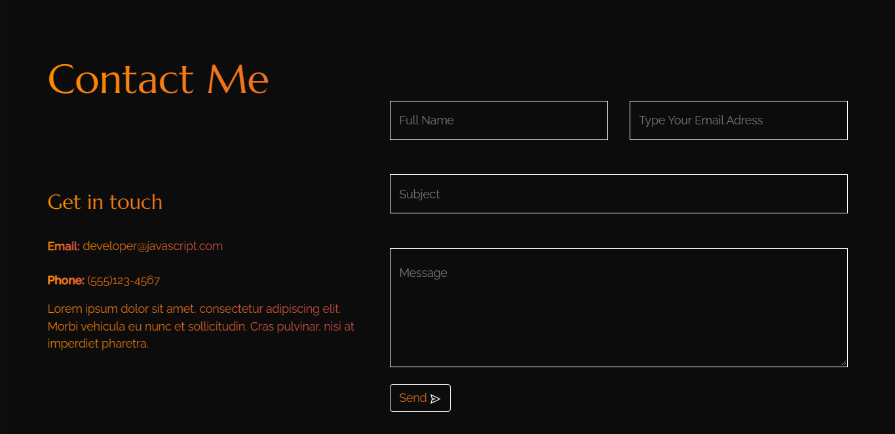

# Project Name ( React form contact )

- This project is a test assignement for Eretz front-end position, the task was to demonstrate the knowldge and create a react app taht has a contact us page that should send emails.

# Build with:

- `React`.
- `Bootstrap`.
- `Css`.
- `Emailjs`.

# How it works:

- Clone the app : `git@github.com:dasileker/react-from-contact.git`

- Cd to the folder.
- Install the packages via `npm install`.
- Start the app via `npm start`.

# Final Result

# Note: ( How to create a template and change the keys! )

- If you want to recieve the messages to your Email adress, you need to chane the `'service_fmztxkc', 'template_4qkhicb', 'OdsapR4KpJKyC5q9T'` in the ./contact/index.js to be able to receive emails.

- step 1: go to `https://www.emailjs.com` and create an account the click on the `Add New Service` and select the service you want. then click on `Email Template`
- step 2: got to `https://www.emailjs.com/docs/examples/reactjs/` and follow the documentation.
- step 3: first replace the 'service_fmztxkc' => YOUR_SERVICE_ID, 'service_fmztxkc' => YOUR_TEMPLATE_ID, and 'OdsapR4KpJKyC5q9T' => YOUR_PUBLIC_KEY

# Author

- Github: [dasileker](https://github.com/dasileker)
- linkedin: [Amine Zerradi](https://www.linkedin.com/in/amine-zerradi/)
- Portfolio: [Amine Zerradi](https://zerradi.web.app)
